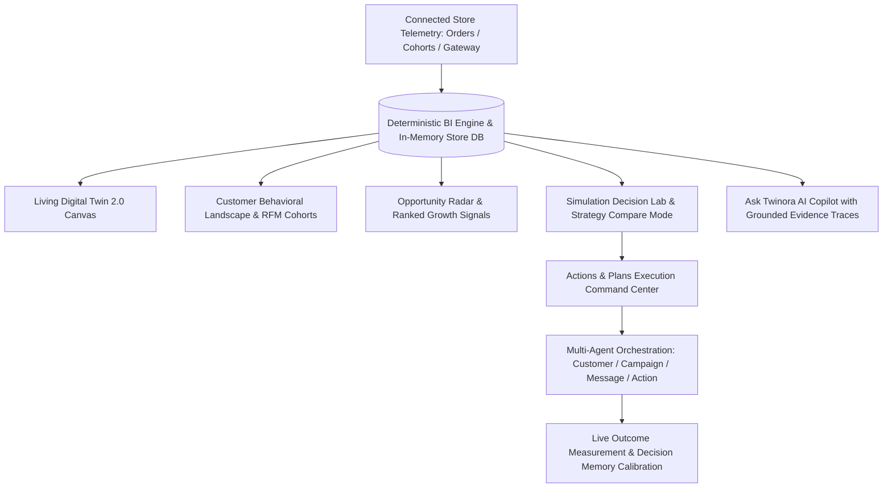

# Twinora AI — Living Digital Twin & Business Decision Intelligence SaaS

> **SEE TOMORROW. BEFORE YOU DECIDE.**  
> Twinora AI is a production-grade AI decision intelligence platform that transforms raw merchant telemetry into a living digital twin, simulated decision scenarios, and automated action execution.

---

## 🌟 Key Architecture & Workspaces



---

## 🚀 Features

### 1. Living Digital Twin 2.0 (`/twin`)
- Asymmetric 6-dimensional business mesh (`Revenue`, `Customers`, `Retention`, `Products`, `Growth`, `Payments`).
- Node status and particle flow rates update dynamically from database order velocity.
- Interactive **Node Inspector Drawer** with health diagnostics, major revenue drivers, and connected dimension routing.

### 2. Simulation Decision Lab & Strategy Compare Mode (`/simulate`)
- **Single Scenario Sandbox**: Calibrate target customer cohorts, incentive discounts, and evaluation horizons.
- **Decision Compare Mode**: Side-by-side strategy evaluation (Baseline vs Strategy A vs Strategy B vs Strategy C) with mathematically modeled confidence ranges, margin impact, retention lift, and downside risk.
- **Decision Memory Table**: Historical prediction tracking vs verified 14-day outcomes with `Awaiting Outcome` calibration.

### 3. Actions & Plans Execution Workspace (`/actions`)
- **Two-Column Command Center**:
  - **Interactive State Machine Timeline**: `Strategy` $\rightarrow$ `Approval` $\rightarrow$ `Queued` $\rightarrow$ `Running` $\rightarrow$ `Measuring` $\rightarrow$ `Result`.
  - **"Why Twinora Selected This Plan" & Calculation Provenance Drawer**: Discloses baseline order periods, conversion probabilities, and mathematical bounds.
  - **Live Multi-Agent Orchestration Pipeline**: Inspect individual agent inputs, rule checks, and target customer samples.
  - **Role-Based Access Control (RBAC)**: `Owner`, `Admin`, `Analyst`, `Viewer` permissions.
  - **Approval Confirmation Modal & Deep-Navy Live Execution Zone**.
  - **Pre-Approval Plan Editing & Version History** (`v1` $\rightarrow$ `v2` $\rightarrow$ `v3`).

### 4. Ask Twinora Copilot & Intelligence Trace
- Grounded business intelligence drawer with 5-stage reasoning map:
  $$\text{Question} \longrightarrow \text{Signals Checked} \longrightarrow \text{Evidence Found} \longrightarrow \text{Interpretation} \longrightarrow \text{Next Step}$$
- Zero invented numbers: all explanations are grounded in backend calculations.

### 5. Data Connections & Multi-Entity CSV Ingestion (`/settings`)
- Ingestion support for `Customers CSV`, `Orders CSV`, `Products CSV`, and `Payments CSV`.
- Column validation engine showing detected rows, valid rows, duplicate detection, and instant application-wide metric recalculation.
- Real-time **Data Freshness Center** monitoring sync health across all subsystems.

### 6. Executive Intelligence Brief Export
- Instant generation of printable/exportable verified business briefing documents.

---

## 🛠️ Technology Stack

- **Frontend**: React 18, Vite, Tailwind CSS, Framer Motion, Lucide Icons, Canvas Confetti.
- **Backend**: Node.js, Express, Cors.
- **Database & Architecture**: In-Memory Relational Engine + PostgreSQL / Supabase Schema.
- **AI & Intelligence**: Google Gemini 2.5 Flash API (grounded on deterministic calculations).

---

## 💻 Getting Started Locally

### Prerequisites
- Node.js (v18 or higher)
- npm or yarn

### Installation
```bash
# Clone the repository
git clone https://github.com/durisetivarshini-ux/merchant-twin-ai.git
cd merchant-twin-ai

# Install dependencies
npm install

# Setup backend environment (Optional for AI copilot)
# In backend/.env:
# GEMINI_API_KEY=your_gemini_api_key_here
```

### Running the Application
```bash
# 1. Start backend server (Port 5000)
node backend/server.js

# 2. In a separate terminal, start frontend dev server (Port 3000)
npm run dev
```

Open [http://localhost:3000](http://localhost:3000) in your browser.

---

## 🛡️ License
MIT License. Built with ❤️ for next-generation AI business decision intelligence.
